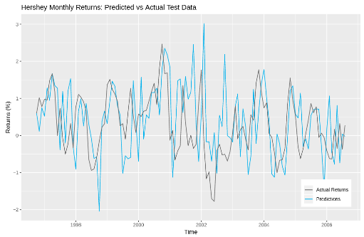

# Forecasting Share Prices with Neural Networks 

This project used deep learning to provide a financial forecast for Hershey stock prices. A report on this project can be found 
[here](ForecastingNN.pdf).

## Data

The code can be found in ```ForecastNeuralnet.R```. Here, 30 years worth of time-series data on Hersheys monthly share prices is read. The data was taken from an online time series database, from the following URL:

http://faculty.chicagobooth.edu/ruey.tsay/teaching/fts/m-hsy6299.dat

The data was smoothed by taking a moving average every 5 months. 

## Training and Testing

A neural network was trained on this data, and used to make a 10 year forecast. 

We can visualize this below:



Achieving around 65% accuracy, the model failed to fully track the price variation over the period, but still recorded the main
trends. 
